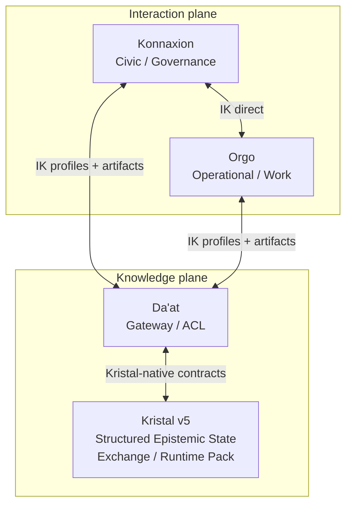

# Architecture

## Decision

Interaction Kernel est un protocole distribué entre bounded contexts autonomes. Il standardise les **frontières**, jamais les domaines internes.

## Plan ownership

| Plan | Owner principal | Objets typiques |
|---|---|---|
| Civic/Governance | Konnaxion | délibération, décision canonique, readings, impact/accountability |
| Operational/Work | Orgo | Signal, Case, Task, Workflow, IntegrationOperation, release/distribution workflow |
| Knowledge/Epistemic | Kristal | Structured Epistemic State, Exchange, ValidationReport, AuthorityRecognition, Runtime Pack, Query Contract |
| Kristal Boundary | Da’at | pinning, mapping, compile invocation, conformance, artifact handoff |
| Cross-system interaction | IK | Command, Query, Event, Receipt, QueryResult, Profiles, ArtifactRefs |

## Invariants

1. **Owner unique** pour tout état autoritaire.
2. Aucun write direct dans la persistence d’un autre participant.
3. Konnaxion ↔ Orgo reste direct par défaut.
4. Kristal n’est jamais un passage obligatoire sauf Profile `GATED`.
5. Da’at est la frontière recommandée vers Kristal.
6. IK n’a aucune source de vérité métier globale.
7. Les lifecycles locaux ne sont jamais fusionnés.

## Kristal modes

| Mode | Flux | Usage |
|---|---|---|
| `DIRECT` | Konnaxion ↔ Orgo | aucun besoin de connaissance Kristal |
| `ENRICHED` | interaction directe + `ArtifactRef` Kristal | connaissance disponible mais non bloquante |
| `GATED` | export → Da’at/Kristal → artifact requis → interaction | le Profile exige un artefact ou statut épistémique |

## Normative architecture rules

- `IK-ARCH-001` — **MUST NOT** : aucun flux Konnaxion↔Orgo ne transite obligatoirement par Kristal sauf knowledge gate explicite du Profile.
- `IK-ARCH-002` — **MUST** : Da’at est la frontière de référence entre IK et Kristal; IK ne réécrit pas les schémas Kristal.
- `IK-ARCH-003` — **MUST** : un participant mute uniquement son propre état autoritaire.
