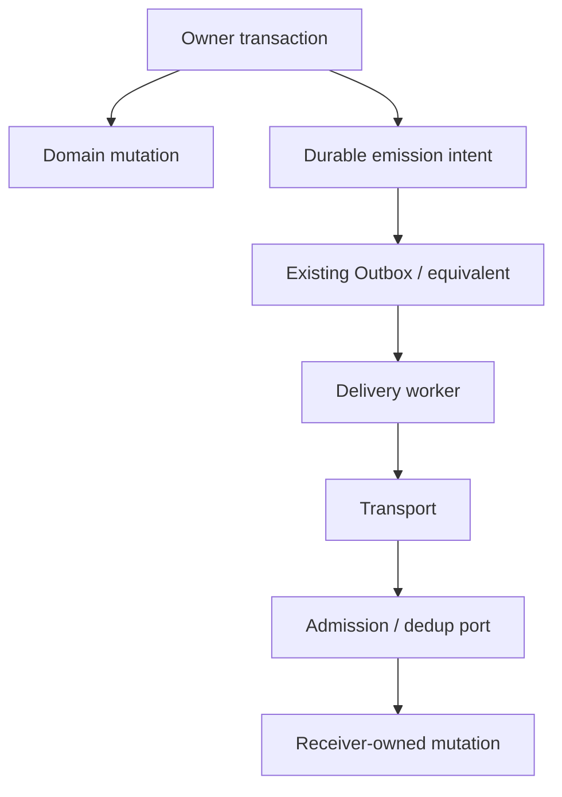

# Reliability

## Delivery model

IK-Reliable spécifie les **garanties et les ports**, pas un schema de persistence universel.



## Delivery semantics

Le modèle de référence est :

```text
at-least-once delivery
+ idempotent processing
+ deduplication
+ reconciliation
```

IK ne promet pas exactly-once réseau.

## Host reuse

- **Orgo** réutilise `IntegrationOperation`, `OutboxMessage` et `OutboxWorker`.
- **Konnaxion** ajoute ou réutilise un mécanisme durable compatible avec le transaction scope de sa décision canonique.
- Une implémentation conforme n’a pas à créer une seconde Inbox/Outbox si elle possède déjà un mécanisme équivalent.

## Idempotency

- `IK-REL-001` — **MUST** : retry/redrive du même effet logique réutilise la même idempotency identity.
- `IK-REL-002` — **MUST** : même identity + contenu métier divergent produit un conflit explicite.
- `IK-REL-003` — **MUST NOT** : imposer une seconde table Inbox/Outbox lorsque le host satisfait déjà les garanties.

## Ordering

`IK-REL-005` — **MUST** : IK ne garantit aucun ordre global. Un Profile qui exige de l’ordre doit définir :

- ordering key;
- sequence;
- comportement sur gap;
- comportement sur reorder.

## Canonical semantic fingerprint

`IK-REL-004` — **MUST** : le replay est comparé sur un fingerprint déterministe de la requête sémantique :

```text
class
profile
target
subject
authority
data
artifact_refs
```

Les champs volatils comme `time` et `trace` sont exclus.

L’algorithme exact reste ouvert : voir [ADR-IK-04](adrs/ADR-IK-04-canonical-reliable-fingerprint.md).

## Lifecycles

| Plan | États typiques |
|---|---|
| Delivery | `persisted / queued / sending / delivered / retrying / dead` |
| IK disposition | `accepted / rejected / blocked / succeeded / failed` |
| Domain | entièrement local au participant |

`OutboxMessage=SUCCEEDED` ne signifie pas que l’opération externe est un succès métier final.
