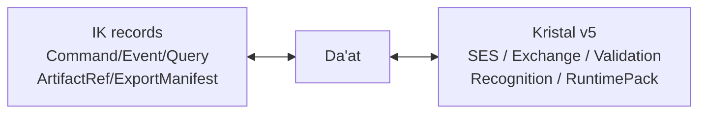
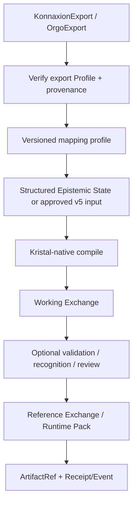

# Kristal and Da’at

## Baseline decision

Kristal v5 est le **Knowledge / Epistemic plane**. Il ne devient pas un middleware Interaction Kernel.

Da’at est :

- participant IK;
- gateway;
- Anti-Corruption Layer;
- pinning/conformance boundary vers Kristal v5.



## Da’at responsibilities

Da’at doit :

- pinner une version/digest Kristal v5 et ses schemas/vectors;
- valider les exports/artefacts au niveau IK/adapter;
- appliquer un mapping profile versionné;
- invoquer les outils/compiler Kristal sans réécrire leurs contrats;
- valider les outputs avec les contracts Kristal pinnés;
- émettre des `ArtifactRef` dans Receipts/Events IK;
- conserver correlation et provenance;
- mapper les failures sans perdre les diagnostics.

## Export → Kristal mapping

Da’at ne convertit pas mécaniquement tous les champs source en assertions.



`IK-KRISTAL-004` — **MUST NOT** : Da’at n’invente pas un Structured Epistemic State par mapping générique. Le mapping est versionné, explicite et testable, sinon la demande est refusée ou déléguée à un extractor déclaré.

## v4 → v5 semantic upgrade

La documentation kOA existante est encore v4-centric. La migration doit corriger ces hypothèses :

| v4 assumption | v5 target |
|---|---|
| Claim-IR → Resolved Claim-IR comme flux central | Structured Epistemic State est normatif; Claim-IR peut être optionnel |
| no-compile-on-fail global | compilation, validation et recognition sont des étapes distinctes |
| Exchange/RuntimePack principalement | working/reference, ValidationReport, AuthorityRecognition, reader policy, federation, revocation |
| pin `kristal-v4` | commit/digest/schema set/vectors Kristal v5 explicitement pinnés |

## Source identity

Pour un record IK émis par le gateway :

```yaml
source:
  system: daat

artifact_refs:
  - owner:
      system: kristal
```

Da’at ne doit pas signer un record en prétendant être Kristal.

## Local queries

Une Query locale sur un Runtime Pack installé utilise le Query Contract Kristal directement. Elle ne doit pas être routée via IK sans frontière inter-système réelle.

## Runtime Pack activation

`kristal.artifact.ready` signifie que le pack existe et a passé les vérifications déclarées. Il **n’active rien automatiquement**.

L’activation passe par un `RuntimePackActivationPort` dont l’owner dépend du déploiement. Voir [ADR-IK-01](adrs/ADR-IK-01-runtime-pack-activation-owner.md).
