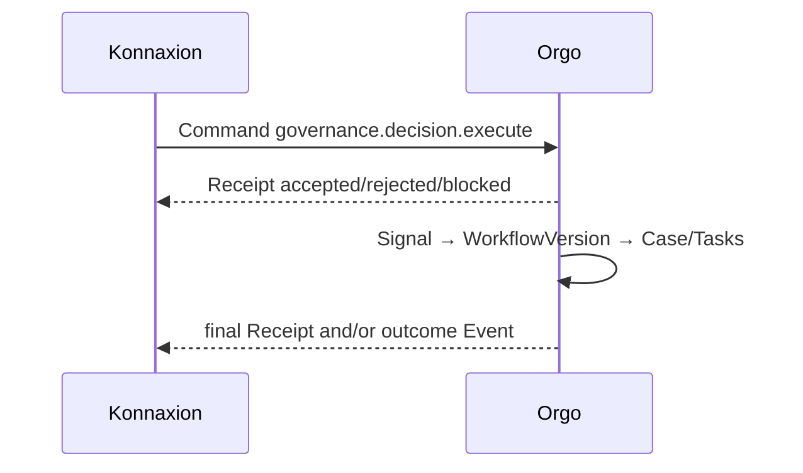
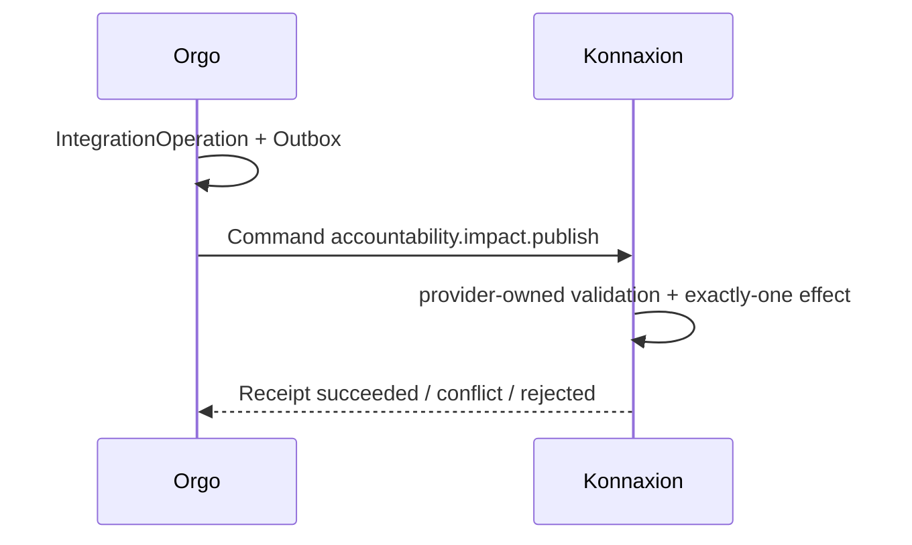
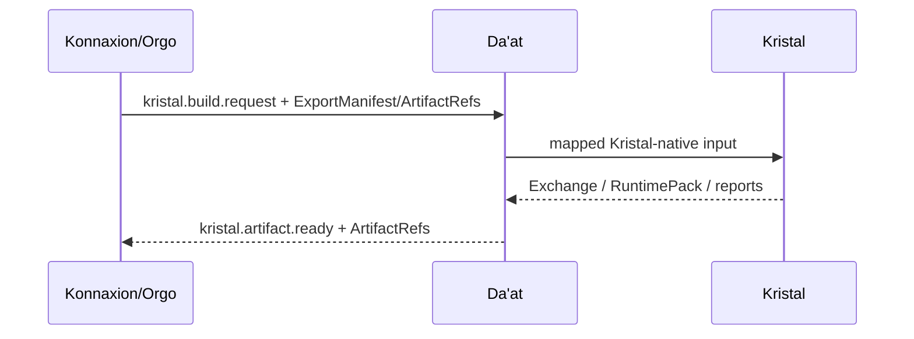
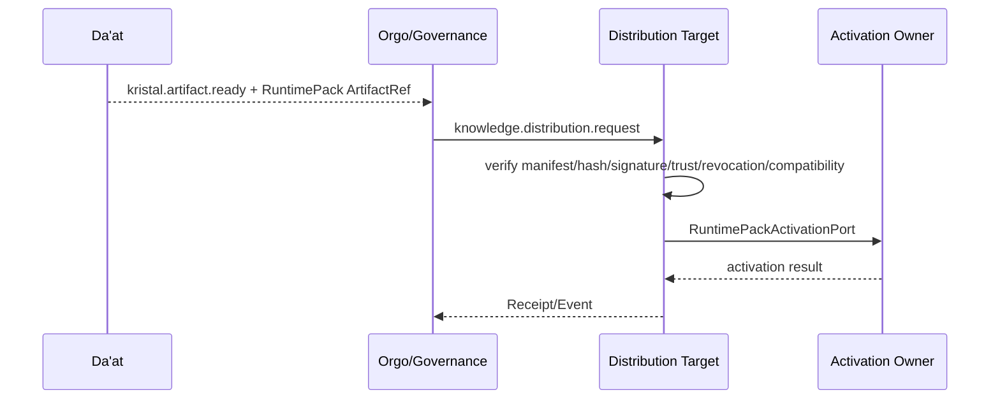

# Canonical flows

## 1. Direct Konnaxion → Orgo



Le sender ne crée jamais directement Case/Task.

## 2. Orgo → Konnaxion impact publication



## 3. Knowledge enrichment



## 4. Runtime Pack distribution



Un seul activation state est autoritaire. Voir ADR-IK-01.

## 5. Reconsideration

Orgo ne rouvre pas une décision Konnaxion. Il publie un Event, par exemple :

```yaml
class: event
profile:
  id: operational.reconsideration.recommended
  version: 1.0.0
source:
  system: orgo
target:
  system: konnaxion
data:
  reconsideration_recommended: true
  authority_effect: none
```

Konnaxion décide localement de la suite.
